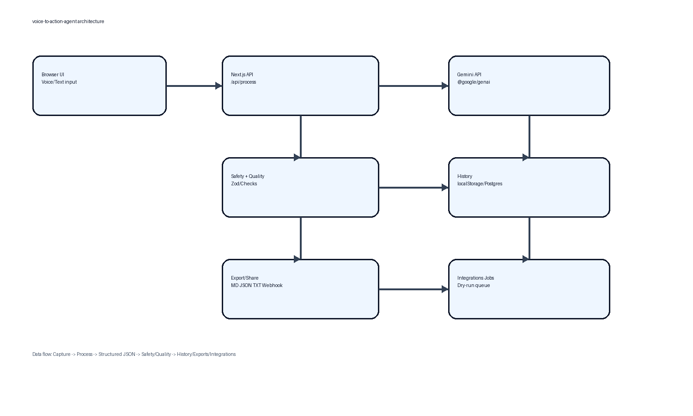

# Architecture



## High-Level Flow

```text
Browser UI (Web Speech API + Text Fallback)
        |
        | POST /api/process
        v
Next.js Route Handler (/app/api/process)
  - request validation (Zod)
  - request size + rate limit checks
  - transcript normalization
  - Gemini structured output call (@google/genai)
  - deterministic safety_check
  - response shaping + meta
        |
        v
Structured JSON Response
        |
        +--> Local history store (localStorage, default)
        |
        +--> DB history write (when HISTORY_MODE=db)
        |
        +--> Export/Share pipeline (markdown/json/txt + webhook + signed link)
        |
        +--> Integration job queue (dry-run stubs)
```

## Components

- `components/voice-action-dashboard.tsx`
- `app/history/*`
- `app/settings/page.tsx`
- `app/integrations/page.tsx`
- `app/share/[token]/page.tsx`
- `app/status/page.tsx`

## Server Modules

- `lib/schema.ts` strict output contract + JSON schema
- `lib/gemini.ts` server-only model call wrapper
- `lib/safety.ts` deterministic groundedness checks
- `lib/rateLimit.ts` per-client minute + burst limiter
- `lib/db.ts` postgres abstraction for db mode
- `lib/history.ts` local mode storage and migrations
- `lib/quality.ts` deterministic quality score checks
- `lib/compliance.ts` profanity/PII-safe handling
- `lib/observability.ts` in-memory metrics and structured logs
- `lib/promptRegistry.ts` prompt version management
- `lib/share.ts` signed share links

## Notes

- All Gemini calls are server-side only.
- API key is never sent to the browser.
- Structured output is schema-enforced at model and server layers.
- Export/webhook modules strip secrets and only forward session payload fields.
